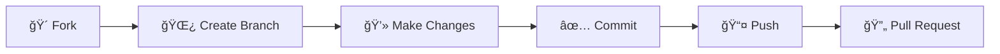

<div align="center">

# 🎓 Virtual Classroom Platform

<p align="center">
  
  
  
  
</p>

<p align="center">
  <strong>🚀 A comprehensive, modern virtual learning management system built with Spring Boot</strong>
</p>

<p align="center">
  Designed for seamless online education experiences with real-time communication, interactive learning tools, and comprehensive analytics.
</p>

---

</div>

## 📸 Screenshots

<div align="center">

| Home | Instructor Dashboard | Student Dashboard |
|---|---|---|
|  |  |  |

| Live Meeting | Whiteboard |
|---|---|
|  |  |

</div>

## ✨ Features Overview

<table>
<tr>
<td width="50%">

### 🔐 **Authentication & Security**
- 🛡️ JWT-based secure authentication
- 👥 Role-based access control (Student, Instructor, Admin)
- 🔑 User profile management
- 🔄 Password reset functionality

### 📚 **Course Management**
- 📖 Create and manage courses with rich content
- 🎥 Lesson organization with video support
- 📝 Assignment creation and submission system
- 📊 Course enrollment and progress tracking
- 📁 File upload/download for assignments

### 💬 **Real-Time Communication**
- ⚡ WebSocket-powered live chat system
- 🗣️ Course-specific discussion forums
- 🧵 Threaded conversations and replies
- 🔔 Real-time notifications
- 💌 In-app messaging system
- 🎥 Live video meetings (Agora RTC)

</td>
<td width="50%">

### 📊 **Analytics & Dashboard**
- 🎓 **Student Dashboard**: Progress tracking, assignments, course overview
- 👨‍🏫 **Instructor Dashboard**: Student analytics, course statistics, engagement
- 🛡️ **Admin Dashboard**: Platform-wide statistics and user management
- 📈 Comprehensive progress tracking and reporting

### 🔔 **Notification System**
- 📱 Real-time push notifications
- 📧 Email notifications for important events
- ⏰ Assignment due date reminders
- ✅ Course enrollment confirmations
- 💬 Discussion reply notifications

### 🎯 **Learning Management**
- 📈 Interactive lesson progress tracking
- ✍️ Assignment grading and feedback
- 🏆 Course completion certificates
- 📊 Student performance analytics
- 🛤️ Customizable learning paths

</td>
</tr>
</table>

---

## 🛠️ Technology Stack

<div align="center">

### Backend Technologies
<p>
  
  
  
  
  
  
</p>

### Frontend Technologies
<p>
  
  
  
  
</p>

### Additional Tools
<p>
  
  
  
  
</p>

</div>

---

## 🚀 Quick Start Guide

### 📋 Prerequisites

<table>
<tr>
<td align="center"></td>
<td align="center"></td>
<td align="center"></td>
</tr>
</table>

### ⚡ Installation & Setup

> Note on Maven vs Maven Wrapper
>
> - You can run the project with the Maven Wrapper (recommended) or a locally installed Maven.
> - Windows (PowerShell/CMD): use `.\mvnw.cmd ...`
> - Git Bash/macOS/Linux: use `./mvnw ...`
> - If Maven is installed and on PATH, you can use `mvn ...` instead of the wrapper.

#### 🔧 **Method 1: Using Maven Wrapper (Recommended)**
```bash
# 1️⃣ Clone the repository
git clone https://github.com/intensealchemist/VirtualCLass-1.git
cd VirtualCLass-1

# 2️⃣ Make Maven wrapper executable (Linux/Mac)
chmod +x mvnw

# 3️⃣ Build and run the application
./mvnw clean install
./mvnw spring-boot:run

# For Windows users:
.\mvnw.cmd clean install
.\mvnw.cmd spring-boot:run
```

#### 🔧 **Method 2: Using Local Maven Installation**
```bash
# 1️⃣ Clone the repository
git clone https://github.com/intensealchemist/VirtualCLass-1.git
cd VirtualCLass-1

# 2️⃣ Build and run with Maven
mvn clean install
mvn spring-boot:run
```

#### 🔧 **Method 3: Using IDE (IntelliJ IDEA/Eclipse)**
```bash
# 1️⃣ Clone the repository
git clone https://github.com/intensealchemist/VirtualCLass-1.git

# 2️⃣ Import as Maven project in your IDE
# 3️⃣ Run the main class: VirtualClassroomApplication.java
# 4️⃣ Application will start on port 8080
```

### 🗄️ Database Configuration

#### **Option 1: H2 In-Memory Database (Default - No Setup Required)**
```properties
# Already configured in application.properties
# Perfect for development and testing
# Access H2 Console: http://localhost:8080/h2-console
```

#### **Option 2: MySQL Database (Production Recommended)**
```bash
# 1️⃣ Create MySQL database
mysql -u root -p
CREATE DATABASE virtual_classroom;
CREATE USER 'vc_user'@'localhost' IDENTIFIED BY 'your_password';
GRANT ALL PRIVILEGES ON virtual_classroom.* TO 'vc_user'@'localhost';
FLUSH PRIVILEGES;
EXIT;

# 2️⃣ Update application.properties
```

```properties
# MySQL Configuration (add to application.properties)
spring.datasource.url=jdbc:mysql://localhost:3306/virtual_classroom
spring.datasource.username=vc_user
spring.datasource.password=your_password
spring.datasource.driver-class-name=com.mysql.cj.jdbc.Driver
spring.jpa.database-platform=org.hibernate.dialect.MySQL8Dialect
spring.jpa.hibernate.ddl-auto=update
```

### 🚀 Running the Application

```bash
# Start the application
./mvnw spring-boot:run

# Or with custom port
./mvnw spring-boot:run -Dspring-boot.run.arguments=--server.port=8080

# Run with specific profile
./mvnw spring-boot:run -Dspring-boot.run.profiles=dev

# Build JAR file
./mvnw clean package

# Run JAR file
java -jar target/virtual-classroom-platform-2.0.0.jar
```

### 🎥 Live Meetings (Agora) Setup

Follow these steps to enable live video sessions using Agora:

1. __Create an Agora project__
    - Sign up at https://console.agora.io and create a project (Web SDK).
    - Copy your project’s App ID.

2. __Choose your token mode__
    - __Mode A: No‑token (dev/simple)__ — Works only if your Agora project App Certificate is disabled. The app joins with `token = null`.
    - __Mode B: Secure tokens (recommended for prod)__ — Requires App Certificate enabled and a server‑generated RTC token per join/refresh.

3. __Configure credentials__
   - The view `templates/start_meeting.html` injects `window.AGORA_CONF` used by `static/js/main.js`.
   - Set these application properties or environment variables:
     ```properties
     agora.app-id=<your_app_id>
     # For secure tokens mode, also set your app certificate and optional TTL
     agora.app-certificate=<your_app_certificate>
     agora.token.expire-seconds=3600
     ```
   - In no‑token mode, leave `agora.app-certificate` blank.

4. __Start and join a meeting__
   - Start the app: `./mvnw spring-boot:run`
   - Open a meeting: `http://localhost:8080/meeting/{courseId}` (e.g., `/meeting/1`).
   - Click Join and allow camera/microphone permissions.
   - Open the same URL in another browser/device to see remote participants.

5. __Token refresh endpoint__
   - The client will call `GET /api/video/token/refresh?channel=<channel>` when tokens are about to expire.
   - Note: `AgoraService.generateRtcTokenOrNull()` currently contains a stub — secure token generation must be implemented before Mode B works end‑to‑end.

6. __Whiteboard (optional)__
   - From the meeting page, click “Open Whiteboard” or go to `http://localhost:8080/whiteboard`.

7. __Production guidance__
   - Do not hardcode tokens client‑side. Issue short‑lived tokens server‑side and renew as needed.
   - See: Web Token Server Guides https://docs.agora.io/en/Interactive%20Live%20Streaming/token_server?platform=All%20Platforms

8. __Common issues__
   - 403/Invalid vendor key or token: verify `APP_ID`, token (if used), channel, and expiry.
   - No audio/video: ensure permissions; use HTTPS in production; avoid mixed content.
   - Token expired: implement server token generation and renewal.

### 🔧 Development Commands

```bash
# Clean and compile
./mvnw clean compile

# Run tests
./mvnw test

# Generate test coverage report
./mvnw jacoco:report

# Check for dependency updates
./mvnw versions:display-dependency-updates

# Format code (if spotless plugin is configured)
./mvnw spotless:apply

# Build without tests (faster)
./mvnw clean package -DskipTests
```

### 🐳 Docker Support

```bash
# Build Docker image
docker build -t virtual-classroom .

# Run with Docker Compose
docker-compose up -d

# Stop services
docker-compose down
```

### 🌐 Access Points

<div align="center">

| Service | URL | Description |
|---------|-----|-------------|
| 🏠 **Main Application** | http://localhost:8080 | Primary web interface |
| 📚 **API Documentation** | http://localhost:8080/swagger-ui.html | Interactive API docs |
| 🛡️ **Dashboards** | http://localhost:8080/dashboard | Role-based dashboards (redirects to `/dashboard/student` or `/dashboard/instructor`) |
| 🗄️ **H2 Console** | http://localhost:8080/h2-console | Database management |

| 🎥 **Live Meeting (Agora)** | http://localhost:8080/meeting/{courseId} | Start/join live session (e.g., /meeting/1) |
| 📝 **Whiteboard** | http://localhost:8080/whiteboard | Collaborative whiteboard |

</div>

### 🎯 Default Login Credentials

For testing purposes, you can use these default accounts:

| Role | Email | Password | Description |
|------|-------|----------|-------------|
| 🛡️ **Admin** | admin@virtualclassroom.com | admin123 | Full system access |
| 👨‍🏫 **Instructor** | instructor@virtualclassroom.com | instructor123 | Course management |
| 🎓 **Student** | student@virtualclassroom.com | student123 | Course enrollment |

> **Note:** Change these credentials in production environments for security.

---

## 📋 API Reference

<details>
<summary><strong>🔐 Authentication Endpoints</strong></summary>

| Method | Endpoint | Description |
|--------|----------|-------------|
| `POST` | `/api/auth/login` | User login |
| `POST` | `/api/auth/register` | User registration |
| `POST` | `/api/auth/refresh` | Token refresh |

</details>

<details>
<summary><strong>📚 Course Management</strong></summary>

| Method | Endpoint | Description |
|--------|----------|-------------|
| `GET` | `/api/courses` | List all courses |
| `POST` | `/api/courses` | Create new course |
| `GET` | `/api/courses/{id}` | Get course details |
| `PUT` | `/api/courses/{id}` | Update course |
| `DELETE` | `/api/courses/{id}` | Delete course |

</details>

<details>
<summary><strong>📝 Lessons & Assignments</strong></summary>

| Method | Endpoint | Description |
|--------|----------|-------------|
| `GET` | `/api/lessons/course/{courseId}` | Get course lessons |
| `POST` | `/api/lessons` | Create lesson |
| `GET` | `/api/assignments/course/{courseId}` | Get course assignments |
| `POST` | `/api/assignments` | Create assignment |

</details>

<details>
<summary><strong>💬 Real-time Communication</strong></summary>

| Method | Endpoint | Description |
|--------|----------|-------------|
| `WebSocket` | `/ws` | Chat and notifications |
| `GET` | `/api/chat/room/{roomId}` | Get chat history |
| `POST` | `/api/chat/send` | Send message |
| `GET` | `/api/notifications` | Get user notifications |

</details>

<details>
<summary><strong>📊 Analytics & Dashboard</strong></summary>

| Method | Endpoint | Description |
|--------|----------|-------------|
| `GET` | `/api/dashboard/student` | Student dashboard |
| `GET` | `/api/dashboard/instructor` | Instructor dashboard |
| `GET` | `/api/dashboard/admin/stats` | Admin statistics |

</details>

---

## 🎨 Key Features Highlights

<div align="center">

<table>
<tr>
<td align="center" width="25%">
<br>
<strong>Responsive Design</strong><br>
Cross-device compatibility
</td>
<td align="center" width="25%">
<br>
<strong>Enterprise Security</strong><br>
JWT + Role-based access
</td>
<td align="center" width="25%">
<br>
<strong>Optimized Performance</strong><br>
Real-time updates
</td>
<td align="center" width="25%">
<br>
<strong>Rich Learning Tools</strong><br>
Interactive whiteboard & video
</td>
</tr>
</table>

</div>

---

## 👥 User Roles & Permissions

<table>
<tr>
<td width="33%" align="center">

### 🎓 **Students**


- ✅ Enroll in courses
- 📖 Access lessons and materials
- 📝 Submit assignments
- 📊 Track progress
- 💬 Participate in discussions
- 🔔 Receive notifications

</td>
<td width="33%" align="center">

### 👨‍🏫 **Instructors**


- 📚 Create and manage courses
- 🎥 Upload lessons and materials
- 📝 Create assignments
- ✍️ Grade submissions
- 📈 Monitor student progress
- 🛡️ Moderate discussions

</td>
<td width="33%" align="center">

### 🛡️ **Administrators**


- 👥 Manage all users and courses
- 📊 View platform analytics
- ⚙️ System configuration
- 🔑 User role management
- 📈 Platform monitoring

</td>
</tr>
</table>

---

## 🤝 Contributing

<div align="center">

We welcome contributions! Please follow these steps:



</div>

1. **🍴 Fork** the repository
2. **🌿 Create** a feature branch (`git checkout -b feature/amazing-feature`)
3. **💻 Commit** your changes (`git commit -m 'Add amazing feature'`)
4. **📤 Push** to the branch (`git push origin feature/amazing-feature`)
5. **🔄 Open** a Pull Request

---

## 📄 License

<div align="center">


This project is licensed under the **MIT License** - see the [LICENSE](LICENSE) file for details.

</div>

---

## 📞 Support & Community

<div align="center">

<table>
<tr>
<td align="center">
<br>
<a href="mailto:support@virtualclassroom.com">support@virtualclassroom.com</a>
</td>
<td align="center">
<br>
<a href="https://discord.gg/virtualclassroom">Join our community</a>
</td>
<td align="center">
<br>
<a href="https://github.com/intensealchemist/VirtualCLass-1/wiki">View Wiki</a>
</td>
</tr>
</table>

</div>

---

<div align="center">

**⭐ Star this repository if you find it helpful!**


</div>